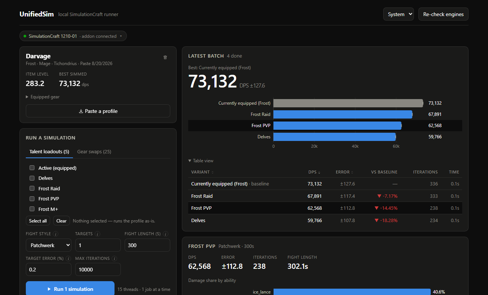

# UnifiedSim

[](https://github.com/Jameshunter1/unifiedsim/actions/workflows/ci.yml)
[](https://github.com/Jameshunter1/unifiedsim/actions/workflows/release.yml)
[](LICENSE)

A local-first desktop app that answers the question World of Warcraft players
actually have — *which gear and talents should I use?* — by running real
[SimulationCraft](https://github.com/simulationcraft/simc) simulations on your
own machine. No cloud queue, no account, no waiting.



## What it does

- **One-click gear comparisons** — each equipment slot lists your bag
  alternates with real stats; one button sims them all against what you're
  wearing. The equipped set is always the baseline, so every percentage means
  something. (On the reference character this surfaced a 263 item-level trinket
  beating the equipped 289 by +3.97% — the case ranking by item level gets wrong.)
- **Talent loadout ranking** — every saved loadout simmed and ranked, with the
  simulation's own error bars.
- **Automatic character import** — a bundled in-game addon writes your
  character on `/usim sync`; a file watcher imports it in under a second.
  Pasting a `/simc` export works too.
- **Item tooltips from the source of truth** — stats come from simc itself,
  bonus IDs resolved with the same client data it sims with. No item database,
  no API key, works offline.
- **A real desktop app** — Electron shell hosting the server in-process:
  taskbar progress, tray, and completion notifications keep working with the
  window closed. The UI is a plain web page and also runs in a browser.

## Quick start

```bash
npm install
npm run simc:fetch      # one-time engine download (see docs/setup.md for caveats)
npm run desktop         # builds everything and opens the app
```

Requires Node 22+. Details, the in-game addon, and every configuration knob:
[docs/setup.md](docs/setup.md).

## How it works

```
WoW client ──/usim sync──▶ SavedVariables.lua
                                │  fs.watch
                                ▼
              Electron main process ─ hosts ─ Node server
                                │                 │
                                │        job queue ▶ SimEngine
                                │                 │   ├─ native simc
                                │   SSE           │   ├─ simc in Docker
                                ▼                 │   └─ wasm / distributed (planned)
              React UI (ranked comparisons, ability breakdowns, history)
```

Every simulation backend implements one `SimEngine` interface; availability is
probed by *executing* each engine, not by checking a file exists, and the app
falls back from native binary to container automatically when the OS refuses
unsigned executables. The full design — and fifteen recorded decisions,
including where this build deliberately departs from its original blueprint —
lives in [ARCHITECTURE.md](ARCHITECTURE.md) and [docs/adr/](docs/adr/README.md).

## CI/CD

- **CI** — build, typecheck, and 72 unit tests on Linux + Windows across Node
  22/24; Lua syntax checking for the in-game addon; a production-dependency
  audit gate (`npm audit --omit=dev --audit-level=high`).
- **Releases** — tagging `vX.Y.Z` packages installers for Windows (NSIS +
  portable), macOS (dmg) and Linux (AppImage), generates checksums, and
  publishes a GitHub Release. Platform legs are independent, so one failure
  never blocks the others. [docs/packaging.md](docs/packaging.md).
- **Dependabot** — grouped weekly updates; Electron majors are the reason
  (only the latest three receive security patches).

## Development

```bash
npm run dev         # Vite UI on :5273 + API on :8730, with HMR
npm test            # 72 unit tests (parser + server)
npm run typecheck   # all workspaces, in dependency order
```

A 49-check end-to-end API suite runs against the live app during development;
the parser round-trips a real addon export byte-for-byte, and the test fixture
is a real character.

| Path | |
|---|---|
| `packages/simc-profile` | Parser/serialiser for the SimC addon export format |
| `apps/server` | Express API, job queue, engine interface, SavedVariables watcher |
| `apps/web` | React UI — hand-rolled SVG charts, no chart library |
| `apps/desktop` | Electron shell: tray, menus, native install flows |
| `addon/UnifiedSim` | The in-game Lua addon |
| `docker/simc` | Linux simc image, built from source |
| `engine-wasm` | Browser engine scaffold (Emscripten entry point) |

## Documentation

| | |
|---|---|
| [docs/setup.md](docs/setup.md) | Engines, the addon, configuration |
| [docs/packaging.md](docs/packaging.md) | Local packaging and the release pipeline |
| [ARCHITECTURE.md](ARCHITECTURE.md) | How the system fits together, and what's still open |
| [docs/adr/](docs/adr/README.md) | Why it's built this way — 15 decision records |
| [CONTRIBUTING.md](CONTRIBUTING.md) | Setup and the rules a PR is held to |
| [SECURITY.md](SECURITY.md) | Scope, and the intentional behaviours that look alarming |
| [NOTICE.md](NOTICE.md) | SimulationCraft is GPL-3.0 and is run, not bundled |

Planned work is tracked in
[milestones](https://github.com/Jameshunter1/unifiedsim/milestones): code
signing, in-game addon verification, an upgrade planner, a WebAssembly engine,
distributed search, and an in-game rotation overlay.

## License

[MIT](LICENSE). World of Warcraft is a trademark of Blizzard Entertainment;
this is an unofficial, unaffiliated tool.
